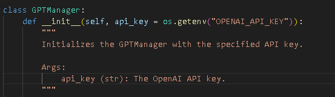
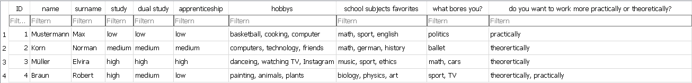
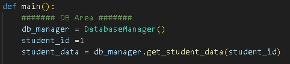
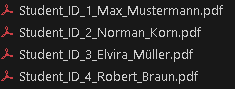

1. Create and insert the API key.

2. Insert the student's data into the database.

3. Select the student's ID and start the application.

4. Use the generated PDF file and check if the output is appropriate.

5. Done.